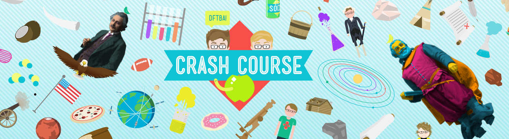

# PlasmaVille
A submission for Unity Global Student Competition, a 3-D top down free roaming game to learn about facts of human body, where the human body is portrayed as a city with cells as human beings. 

Find the game and the visuals from link below
https://connect.unity.com/p/void-public-under_progress

---

**Note** : *Due to the discontinuation of https://connect.unity.com/ the link for game submission has been pulled down. Please refer to the alternative descriptions provided in this readme file as a substitute.*

---

Project Start Date : 1st Jan 2018\
Project End Date : 25th Jan 2018

The inspiration for this project was heavily inspired by the infotainment contents of Youtube channels such as CrashCourse, which aims to provide interesting information to the common public who aren't well articulated with certain fields such as arts, medicine, war, history and computer science.

As a computer science major, I and my team decided to take up human anatomy as the topic to get out of the comfort zone and experiment with what we can create against the tight deadline, culminating all our experiences of Unity Engine.

The presentation of our work was inspired by the anime "Cells at Work".

---
### Tools and Tech Stack
- Blender3D
- Illustrator
- Unity Engine
- GIMP
- ezgif
- OBS

### Highlights

### Concept Arts

### 1st Mini Game - Double Circulation

The first mini-game was set to just test out the navigation of our player, and copying a top-down RTS input system, where the mouse RMB button could be used to walk the player around the whole world.

The layout of the game map was heavily inspired to mimic the double circulation that RBCs have to go through in a human body.

Keeping some of the finer details in mind, the path highlighted by blue lines, all have toll gates to replicate the values of veins that make sure de-oxygenated blood flows in one direction.

### 2nd Mini Game - Shooter

The second mini-game was a third-person shooter, where according to game, the player takes control of a WBC (Killer T cell) which fight off more resistant antigens and germs in our bodies when the first wave of WBC defense fails.

### 3rd Mini Game - Unity Machine Learning Agents

Keeping the competition criteria in mind, we decided to add a third mini-game which utilizes a simple concept of machine learning, (Genetic Algorithm) and implementing it with Unity's ML agents.

The third mini-game repliactes a tower defence game, where you need to keep setting up White Blood Cell agents to combat germs and prevent them from reaching the end lane.

The XP for buying the WBC agents can be earned by answering the questions, which the player has learned from exploring PlasmaVille.

### Credit Lane

