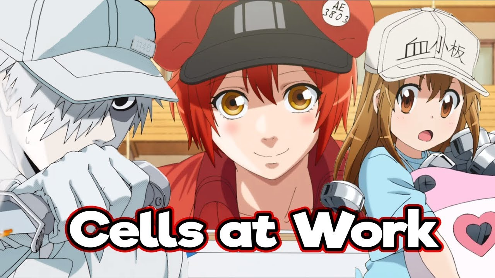
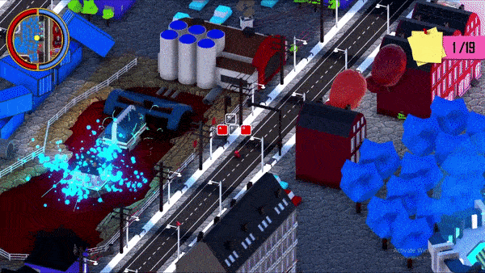
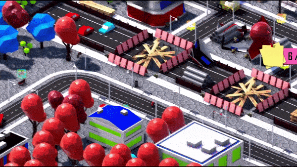
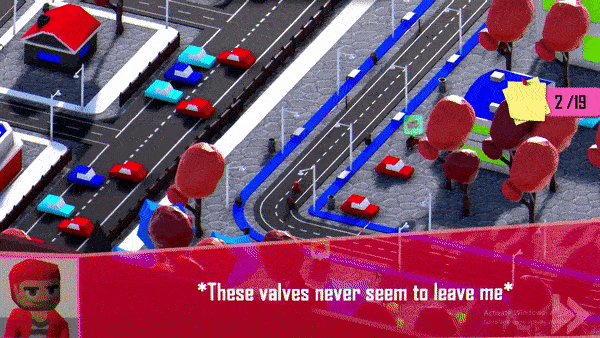
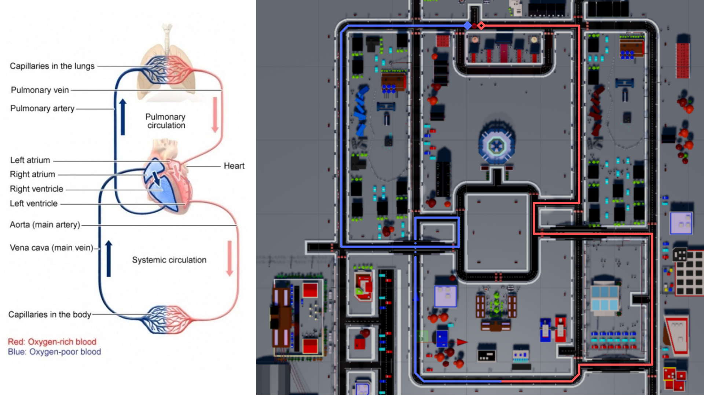
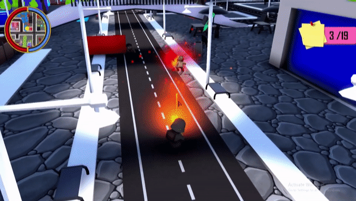
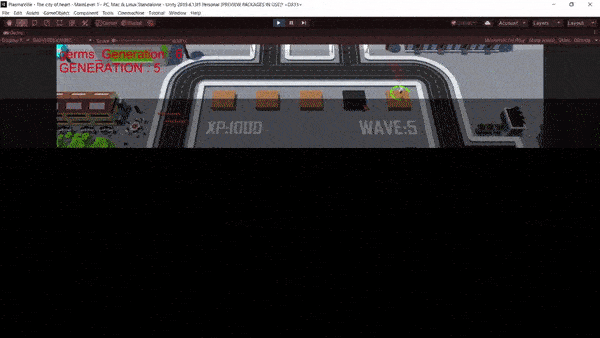
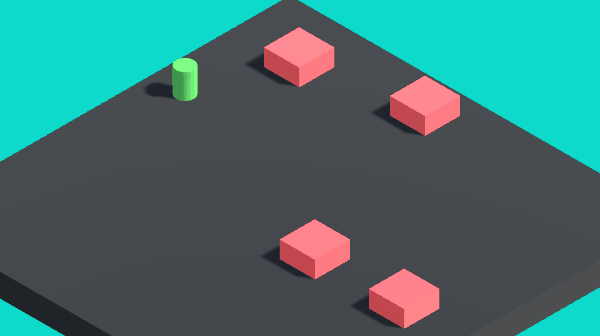
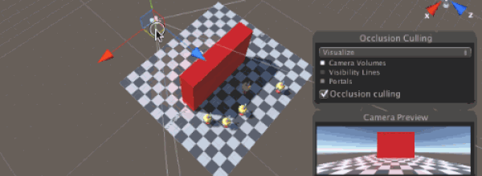

# PlasmaVille
A submission for Unity Global Student Competition, a 3-D top down free roaming game to learn about facts of human body, where the human body is portrayed as a city with cells as human beings. 

Find the game and the visuals from link below
https://play.unity.com/p/void-public-under_progress

---

**Note** : *This is a small formal overview of the game. Go to https://play.unity.com/p/void-public-under_progress to see the unscripted progress and informal overview, created on the go during the competition*

---

Project Start Date : 1st Jan 2018\
Project End Date : 25th Jan 2018

The inspiration for this project was heavily inspired by the infotainment contents of Youtube channels such as CrashCourse, which aims to provide interesting information to the common public who aren't well articulated with certain fields such as arts, medicine, war, history and computer science.

As a computer science major, I and my team decided to take up human anatomy as the topic to get out of the comfort zone and experiment with what we can create against the tight deadline, culminating all our experiences of Unity Engine.

The presentation of our work was inspired by the anime "Cells at Work".

---
### Tools and Tech Stack
- Blender3D
- Illustrator
- Unity Engine
- GIMP
- ezgif
- OBS

### Highlights and Concept

The initial map of Plasmaville was roughly drawn in MS Paint as a prototype to map out the different locations of human bodies being shown in form of a busy city.

Each player in the city is a cell of some sort from the human body, with the player being a RBC (Red Blood Cell).

A lot of liberty was taken for aesthetic purposes, and the final outcome includes quickly put together scenaries such as 

- Mitochondria - the powerhouse of cell; depicted by a busy factory in the city

- Plasma - containing electrolytes; shown by a lake with electric motors, and electric pole lines to power the whole city

- Platelet Clotting - blood clots after an injury; shown by repairing damaged grounds in the city

- Valves - to aid uni-directional flow of deoxygenated blood; shown by road tolls.

### 1st Mini Game - Double Circulation

The first mini-game was set to just test out the navigation of our player, and copying a top-down RTS input system, where the mouse RMB button could be used to walk the player around the whole world.

The layout of the game map was heavily inspired to mimic the double circulation that RBCs have to go through in a human body.

Keeping some of the finer details in mind, the path highlighted by blue lines, all have toll gates to replicate the values of veins that make sure de-oxygenated blood flows in one direction.

### 2nd Mini Game - Shooter

The second mini-game was a third-person shooter, where according to game, the player takes control of a WBC (Killer T cell) which fight off more resistant antigens and germs in our bodies when the first wave of WBC defense fails.

### 3rd Mini Game - Unity Machine Learning Agents

Keeping the competition criteria in mind, we decided to add a third mini-game which utilizes a simple concept of machine learning, (Genetic Algorithm) and implementing it with Unity's ML agents.

The third mini-game repliactes a tower defence game, where you need to keep setting up White Blood Cell agents to combat germs and prevent them from reaching the end lane.

The XP for buying the WBC agents can be earned by answering the questions, which the player has learned from exploring PlasmaVille.

### Technical Overview

The game uses simple but effective techniques learnt over one and half years of using Unity. The project was implemented utilizing all the tools and technicalities mentioned in brief here.

- NavMesh AI - For path finding and character movement

- Occulusion Culling - For reducing resource consumption

- Shader Graph - For realistic Water Reflection

### Credit Lane

The credit lane was added as an extra location in the game to thank all the other artists who contributed (through email or consents) and allowed us to use their terrific artworks and music for the competition.

The credit lane features all the artists represented by an NPC with whom the player can interact with, to learn of thier contributions for the project.

